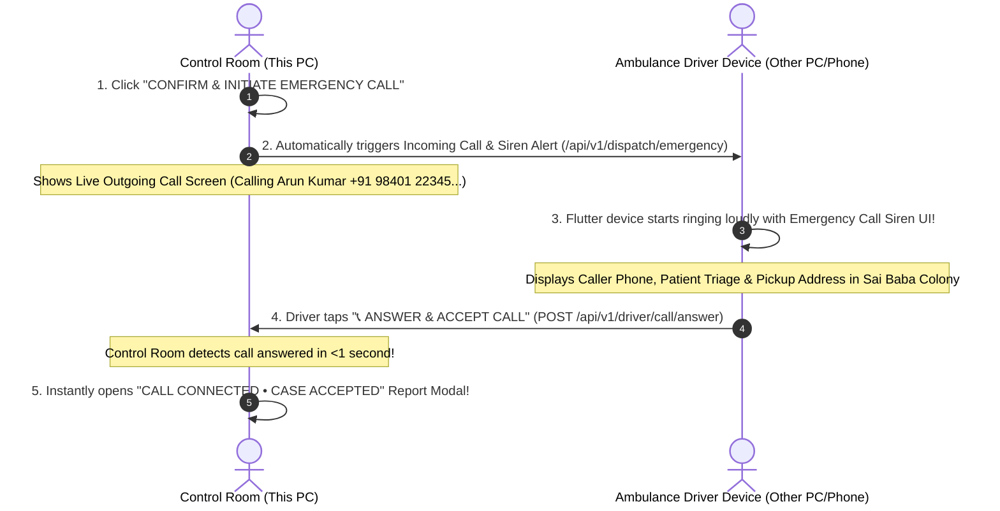

# Walkthrough — Automatic Emergency Call Initiation to Flutter Device

When you click **"CONFIRM & INITIATE EMERGENCY CALL TO DRIVER APP →"**, the Control Room **automatically triggers a live incoming emergency call on the ambulance driver's Flutter device in Sai Baba Colony, Coimbatore**.

---

## 1. Automatic Call Flow



---

## 2. Updated Flutter Driver Incoming Call Code (For Other PC / Phone)

Put this in your Flutter project on the **other device**:

```dart
import 'dart:async';
import 'dart:convert';
import 'package:flutter/material.dart';
import 'package:http/http.dart' as http;

class AmbulanceCallScreen extends StatefulWidget {
  final String ambulanceId;

  const AmbulanceCallScreen({Key? key, this.ambulanceId = 'AMB-1042'}) : super(key: key);

  @override
  _AmbulanceCallScreenState createState() => _AmbulanceCallScreenState();
}

class _AmbulanceCallScreenState extends State<AmbulanceCallScreen> {
  // Use Control Room IP
  final String baseUrl = 'http://172.18.234.213:3000/api/v1';

  Map<String, dynamic>? activeCall;
  bool isRinging = false;
  Timer? _pollingTimer;

  @override
  void initState() {
    super.initState();
    // Poll every 1.5 seconds for incoming emergency calls
    _pollingTimer = Timer.periodic(const Duration(milliseconds: 1500), (timer) {
      checkForIncomingCall();
    });
  }

  @override
  void dispose() {
    _pollingTimer?.cancel();
    super.dispose();
  }

  /// 1. Poll incoming call status
  Future<void> checkForIncomingCall() async {
    try {
      final res = await http.get(
        Uri.parse('$baseUrl/driver/${widget.ambulanceId}/incoming-call'),
        headers: {'Content-Type': 'application/json'},
      );

      if (res.statusCode == 200) {
        final json = jsonDecode(res.body);
        if (json['hasIncomingCall'] == true && json['data'] != null && json['data']['answered'] == false) {
          setState(() {
            activeCall = json['data'];
            isRinging = true;
          });
        }
      }
    } catch (e) {
      print('Polling error: $e');
    }
  }

  /// 2. Answer & Accept Call
  Future<void> answerCall() async {
    if (activeCall == null) return;
    try {
      final res = await http.post(
        Uri.parse('$baseUrl/driver/call/answer'),
        headers: {'Content-Type': 'application/json'},
        body: jsonEncode({
          'caseId': activeCall!['caseId'],
          'ambulanceId': widget.ambulanceId,
          'status': 'ACCEPTED',
          'responseSeconds': 3,
        }),
      );

      if (res.statusCode == 200) {
        setState(() {
          isRinging = false;
        });
        ScaffoldMessenger.of(context).showSnackBar(
          const SnackBar(content: Text('✓ Call Answered! Navigating to incident in Sai Baba Colony...'), backgroundColor: Colors.green),
        );
      }
    } catch (e) {
      print('Answer error: $e');
    }
  }

  @override
  Widget build(BuildContext context) {
    return Scaffold(
      backgroundColor: isRinging ? const Color(0xFF0F172A) : Colors.white,
      appBar: AppBar(
        title: Text('AMBULANCE ${widget.ambulanceId} • COIMBATORE'),
        backgroundColor: Colors.red.shade700,
      ),
      body: isRinging && activeCall != null
          ? Center(
              child: Padding(
                padding: const EdgeInsets.all(24.0),
                child: Column(
                  mainAxisAlignment: MainAxisAlignment.center,
                  children: [
                    const Text('🚨 INCOMING EMERGENCY CALL 🚨',
                        style: TextStyle(color: Colors.redAccent, fontSize: 18, fontWeight: FontWeight.bold, letterSpacing: 1.5)),
                    const SizedBox(height: 20),
                    Container(
                      padding: const EdgeInsets.all(20),
                      decoration: BoxDecoration(color: Colors.red.shade600, shape: BoxShape.circle),
                      child: const Icon(Icons.phone_in_talk, size: 60, color: Colors.white),
                    ),
                    const SizedBox(height: 24),
                    Text(activeCall!['caseId'] ?? '', style: const TextStyle(color: Colors.white, fontSize: 22, fontWeight: FontWeight.bold)),
                    const SizedBox(height: 8),
                    Text('📍 ${activeCall!['address'] ?? ''}', style: const TextStyle(color: Colors.white70, fontSize: 15), textAlign: TextAlign.center),
                    const SizedBox(height: 8),
                    Text('Condition: ${activeCall!['patientCondition'] ?? ''}', style: const TextStyle(color: Colors.amberAccent, fontSize: 14)),
                    const SizedBox(height: 40),

                    // ANSWER BUTTON
                    SizedBox(
                      width: double.infinity,
                      height: 56,
                      child: ElevatedButton.icon(
                        style: ElevatedButton.styleFrom(backgroundColor: Colors.green.shade600, shape: RoundedRectangleBorder(borderRadius: BorderRadius.circular(16))),
                        icon: const Icon(Icons.call, color: Colors.white, size: 28),
                        label: const Text('ANSWER & ACCEPT EMERGENCY', style: TextStyle(color: Colors.white, fontSize: 16, fontWeight: FontWeight.bold)),
                        onPressed: answerCall,
                      ),
                    ),
                  ],
                ),
              ),
            )
          : const Center(
              child: Column(
                mainAxisAlignment: MainAxisAlignment.center,
                children: [
                  Icon(Icons.check_circle, color: Colors.green, size: 64),
                  SizedBox(height: 16),
                  Text('Ambulance Online • Standby in Sai Baba Colony', style: TextStyle(fontWeight: FontWeight.bold, fontSize: 16)),
                  SizedBox(height: 8),
                  Text('Listening for automatic emergency calls from Control Room...', style: TextStyle(color: Colors.grey)),
                ],
              ),
            ),
    );
  }
}
```

---

## 3. How to Test

1. Open **`http://localhost:3000/`**.
2. Click **`+ INTAKE EMERGENCY`** -> Click **`CONFIRM & INITIATE EMERGENCY CALL TO DRIVER APP →`**.
3. The Control Room displays the **Live Outgoing Call Screen**:
   - `📞 Calling Driver Arun Kumar (+91 98401 22345)...`
   - `Ringing Driver Device & Sounding Siren (00:03s)...`
4. On your other PC / phone, the Flutter app starts ringing!
5. Tap **"ANSWER & ACCEPT EMERGENCY"** in Flutter (or click `⚡ SIMULATE DRIVER ANSWERS CALL` on Control Room).
6. The Control Room immediately pops up the **"CALL CONNECTED • CASE ACCEPTED" Report Modal** with full details and direct call buttons!
